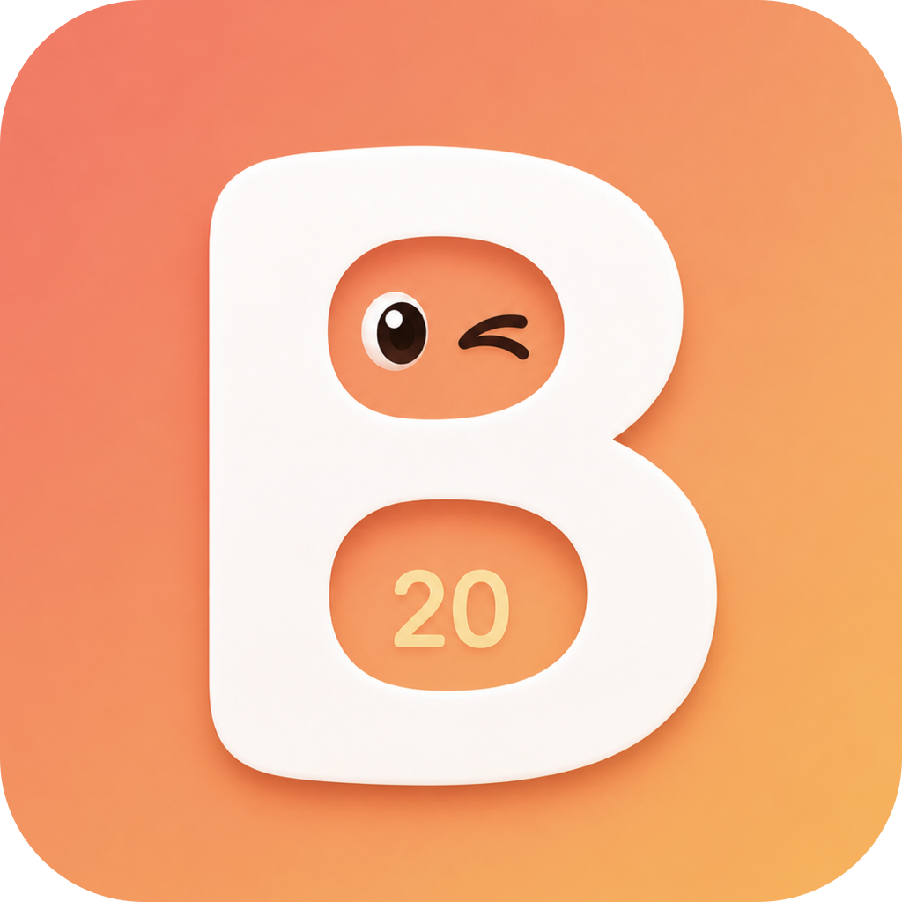

<p align="center">
  
</p>

<h1 align="center">Blink</h1>

<p align="center">
  <strong>Smart 20-20-20 eye break reminder</strong><br>
  <em>for macOS and Windows</em>
</p>

<p align="center">
  <a href="#install"></a>
  <a href="#windows-install"></a>
  
  
</p>

---

> **Why open source?** Blink needs Accessibility permission to work — that's a lot of trust. We made it open source so you can see exactly what we do with it: read input *timing*, never content. No analytics, no telemetry, no network calls. Every line is right here.

> Why commit messages don't follow [conventional commits](https://www.conventionalcommits.org/en/v1.0.0/)? --
I wanted at least one project where I don't have to think of what tags to use in my commit :p

---

Every 20 minutes of screen time, look at something 20 feet away for 20 seconds. Optometrists have recommended this since the 90s. The problem isn't the rule — it's the apps.

They interrupt you mid-thought. They fire a popup while you're in a meeting. They nag you when you already walked away 2 minutes ago. They don't care that you're deep in a coding session and interrupting now will cost you 23 minutes to get back into flow.

**Blink is different.** It watches *how* you work (never *what*) and breaks come at the right moment.

## Install

###  macOS

```bash
curl -fsSL https://raw.githubusercontent.com/D4G4/blink/main/install.sh | bash
```

Downloads the latest release, installs to `/Applications`, and handles quarantine automatically.

###  macOS

```bash
brew tap D4G4/blink
brew install --cask blink
```

Update later with `brew upgrade --cask blink`.

<details>
<summary> macOS</summary>

1. **[Download Blink.dmg](../../releases/latest)** from the latest release
2. Open the DMG, drag **Blink** to the Applications folder
3. Before first launch, run this in Terminal to clear the quarantine flag:
   ```bash
   xattr -cr /Applications/Blink.app
   ```
4. Launch Blink — it appears as an icon in your menu bar
5. Grant **Accessibility** when prompted (required for smart detection)

> The `xattr` step is needed because the app isn't notarized with Apple (we're open source, not paying $99/year for a certificate). Homebrew install handles this automatically.

</details>

<a id="windows-install"></a>

### 

1. **[Download Blink-x64.exe](../../releases/latest)** from the latest release (or `Blink-arm64.exe` for ARM devices)
2. Run the exe — Windows SmartScreen may warn "Unknown publisher", click **More info → Run anyway**
3. Blink appears as an icon in your system tray
4. Right-click the tray icon for Settings, Take Break Now, or Quit

> The SmartScreen warning appears because the app isn't code-signed. It's a one-time click — the app works normally after that.

## What makes it smart

- **🧠 Flow detection** — Monitors typing rhythm and app switching. When you're in deep focus, the timer extends from 20 to 30-40 minutes.
- **⏸️ Natural pause waiting** — Doesn't interrupt mid-keystroke. Waits for a 6-second gap in your input — a natural thought boundary.
- **🚶 Walk-away detection** — Left your desk for 3+ minutes? That counts as a break. Timer resets silently.
- **🎬 Video awareness** — Watching YouTube or Netflix? Timer pauses — you're already resting your focus.
- **🎙️ Meeting detection** — Mic or camera active? Timer pauses. No interruptions during calls.
- **🤖 Agent workflow aware** — Waiting for an AI response while scrolling? Timer keeps running. Sitting perfectly still for 3 minutes? That's a walk-away.
- **👁️ Gabor patch exercises** — Built-in vision training with three scientifically studied exercise types. Train your visual cortex to detect subtler contrasts — right from the menu bar or during a break.

## How it works

```
You work normally
        |
    20 minutes pass (or 30-40 in flow)
        |
    Toast appears in corner: "Break in 3s"
        |
    Fullscreen overlay: look away for 20 seconds
        |
    [esc] skip    [->] extend 20s
        |
    Timer resets. Cycle continues.
```

The app lives in your menu bar (macOS) or system tray (Windows). Click to see your timer, flow state, and break stats.

## Eye exercises

Blink includes Gabor patch exercises — a form of vision training backed by research from UC Riverside, RevitalVision, and peer-reviewed studies in Nature Scientific Reports. These exercises don't change your eye's optics; they train your visual cortex to better process low-contrast and fine-detail signals.

Three exercise types, all with adaptive difficulty:

| Exercise | What you do | What it trains |
|----------|------------|----------------|
| **Contrast Detection** | Two circles — one has a faint pattern, one is plain gray. Click the one with the pattern. | Contrast sensitivity — detecting subtle differences |
| **Orientation** | A single pattern appears, tilted slightly left or right. Identify the tilt. | Orientation discrimination — reading fine angular details |
| **Flanker Masking** | Three patterns in a row — identify the center one's tilt while ignoring the distracting outer patterns. | Selective attention — focusing through visual noise |

Each exercise uses a 2-down-1-up adaptive staircase that converges to your contrast threshold — the faintest pattern you can reliably detect. Launch anytime from the menu bar, or tap "Train Eyes" during a break.

*For wellness purposes only — not a medical device or substitute for professional eye care.*

## Themes

Choose during onboarding or change anytime in Preferences.

**Peach** · **Sage** · **Sand** · **Midnight** · **Mono**

Mono is dark-mode-aware — colors invert automatically.

## Privacy

Blink monitors input *timing* (keystroke cadence, app switch frequency, mouse patterns) to detect flow state. It **never** logs:
- What you type
- Which apps you use
- Window contents or titles
- Any personal data

All data stays local (`~/Library/Application Support/Blink/` on macOS, `%LOCALAPPDATA%\Blink\` on Windows) as daily JSON files. The only network call is an optional update check against GitHub Releases. No analytics. No telemetry.

## The 20-20-20 rule

Coined by optometrist Dr. Jeffrey Anshel in 1991:

> Every **20** minutes, look at something **20** feet away, for **20** seconds.

Your blink rate drops from 15/min to 4/min during screen work. This causes dry eyes, headaches, and blurred vision. A 20-second break lets your eye muscles relax and reset.

## Building from source

CI builds run automatically on every push via GitHub Actions. Tagged releases (`v*`) build both platforms, create a GitHub Release with all artifacts, and update the Homebrew cask.

### macOS

```bash
cd blink-macos
brew install xcodegen
xcodegen generate
open Blink.xcodeproj   # Cmd+R to run
```

### Windows

Requires .NET 10 SDK and Windows App SDK.

```bash
cd blink-windows
dotnet build
dotnet run --project src/Blink.App
```

Or open `Blink.Windows.slnx` in Visual Studio 2022+.

### Tests

```bash
# macOS — 85 tests
cd blink-macos/BlinkCore && swift test

# Windows — 74 tests (runs on Mac too)
cd blink-windows && dotnet test
```

## Architecture

```
blink-macos/                    blink-windows/
├── BlinkCore/                  ├── Blink.Core/
│   ├── FlowDetection/         │   ├── FlowDetection/
│   │   ├── 5 signal scorers   │   │   ├── 5 signal scorers
│   │   ├── FlowScoreCalc      │   │   ├── FlowScoreCalc
│   │   └── FlowStateMachine   │   │   └── FlowStateMachine
│   ├── Timer/                  │   ├── Timer/
│   └── Compliance/             │   └── Compliance/
├── Blink/                      ├── Blink.Platform/
│   ├── Platform/ (CGEventTap)  │   ├── WinInputMonitor (hooks)
│   ├── MenuBar/                │   ├── WinAppMonitor
│   ├── Overlay/                │   └── WinIdleDetector
│   ├── Onboarding/             └── Blink.App/
│   ├── Settings/                   ├── TrayIcon/
│   └── Theme/                      ├── Overlay/
└── project.yml                     └── Theme/
```

The core logic (flow detection, timer, compliance) is platform-agnostic. Platform adapters implement 4 interfaces:
- `InputEventSource` — keyboard/mouse timing
- `AppActivitySource` — app switches, window changes
- `IdleStateSource` — time since last input
- `ContextSource` — meetings, video, fullscreen

## License

MIT
